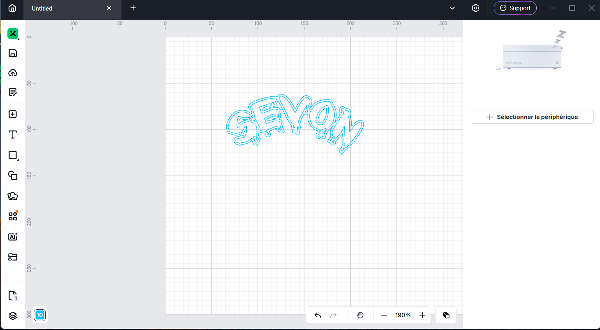

# Journal — maercredi 26 août 2026 (rédigé par : Kangni Marc-Mathieu SEVON)

## Fait aujourd'hui

- Immersion dans les FAbLabs: Généralité
- Immersion dans l'atelier découpe laser
- Immersion dans l'atelier d'électronique
- Immersion dans l'atelier de modélisation 3D

## Les appris du jour:

 ### A la découverte des FabLabs

 > #### Généralité sur les cartes électroniques:
   - Parlant de carte électronique, on peut distingué:
     - Les cartes Arduno
     - Les cartes CIAO notament le ciao esp32-S3
   - Pour les projet la formation est accé sur le lagage de programation MiniPython

 > #### Les découpes lasers:
 - Les types de découpe laser:
   - Les découpes lasers de type CO2
   - les découpes lasers de type fibre
   - Les découpes lasers de type Diode
 - Les classes de laser:
   - Les classe 1: moins puissant et moins dangeureux
   - Les classe 4: plus puissant et plus dangeureux
 - Installation et initiation au logiciel de Xtool Studio en lien avec les découpes lasers
 - 
 
 > #### Atelier d'électronique:
 - Rappel des bases de l'électronique
 - Les grandeurs électriques: tension(V), courant(A), résistance(ohm)
 - Les condensateurs: le stocage de l'éneergie
 - Le multimetre: 
   - mesure de tension
   - mesure de couant
   - mesure de resistance

 > #### Atelier de modélisation 3D:
 - L 'imprimente 3D procède par fabrication additive et permet de relier le domaine de la robotique et celui de l'électronique.

## Logiciel utilisé

- xTool-Studio