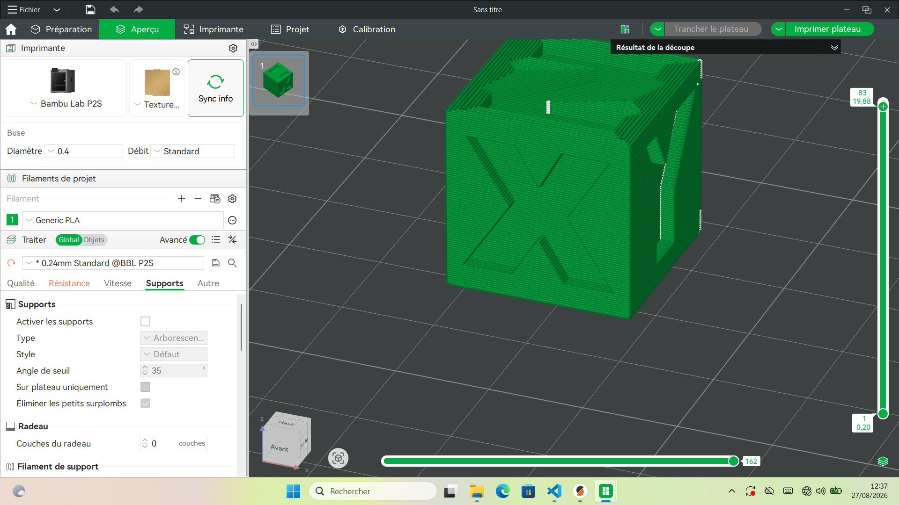
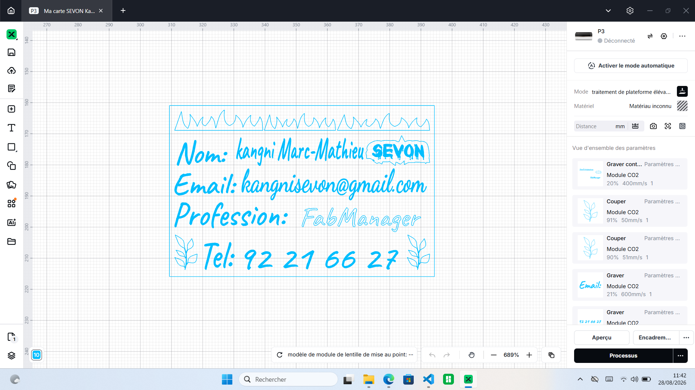

# Journal — Jeudi 27 août 2026 (rédigé par : Prénom NOM)

## Fait aujourd'hui

- Parametrage et impression de la première couche d'un cube 
- 
- Programmation de base d'un cyberPi sur mBlock

## Les appris du jour:

 ### A la découverte des FabLabs
 > #### Atelier de modélisation 3D:
 - Rôle du Slicer
 - Parametre clés : couche, température et vitesse, débrit, rétraction
 - Manipulation de base sur le logiciel "Bambu Studio"
 - Parametrage et impression de la première couche d'un cube
 
 > #### Les découpes lasers:
 - Réalisation d'une carte de visite (nom, prénom, profession, contact)
 - 
 
 > #### Atelier d'électronique:
 ##### Le cyberPi:
 - Le cyberPi
 - 
 - Le Pockert shield
 - 

 ##### Capteur & actionneur :
 - Les capteur mesure les grandeurs et les actionneurs réagissent à la commande venant du programme
 ##### mBlock:
 - Programmer de base une cyderPi

## Logiciel utilisé
- Bambu Studio
- PrusaSlicer
- Fusion Client
- mBlock & CH34x_Install_Windows_driver
