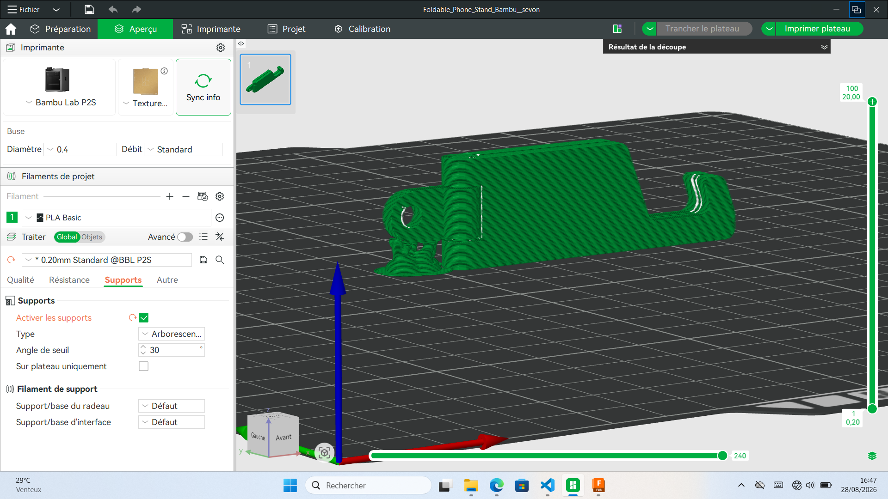
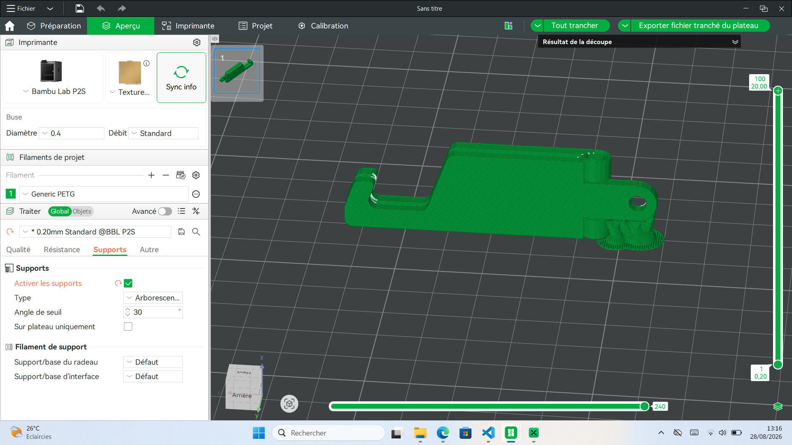
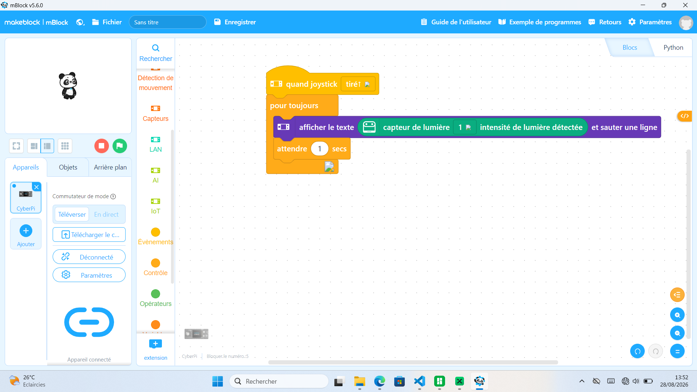
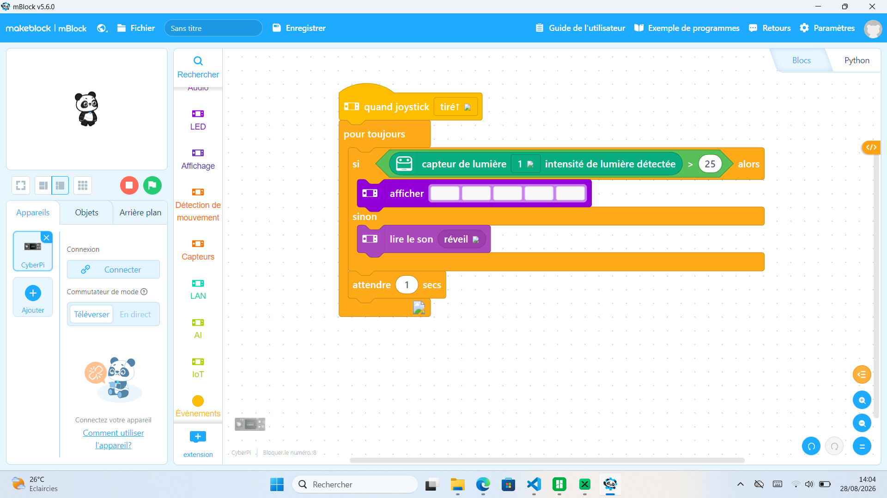

# Journal — Vendredi 28 août 2026 (rédigé par : Kangni Marc-Mathieu SEVON)

## Fait aujourd'hui

- impression de la carte de visite realisé le 2026-08-27
- Utilisation du logiciel Bambu studio pour l'impression 3D- 
- Programation dans mBlock pour allumer les LED du cyberPi si le capteur de lumière est éclairer/non
- 

## Les appris du jour:

 > #### Les découpes lasers:
 - Contunuité de la réalisation d'une carte de visite

 > #### Atelier de modélisation 3D:
 - Utilisation du logiciel Bambu studio pour l'impression 3D
 - Choix de l'imprimente Bambu Lab P2S
 - Choix du filament PETG
 - Activation du support et vu sur apperçu
 - 
 - Positionnement de l'objet 
 - Tranchage de l'objet
 - Enregistrement du ficher d'impression ou impression en ligne 
 - Utilisation de l'imprimente 3D pour l'impression
 - 

 > #### Atelier d'électronique:
 - Programation dans mBlock pour allumer les LED du cyberPi si le capteur de lumière est éclairer/non
 - 
 - Programation dans mBlock pour allumer les LED du cyberPi si le capteur de lumière est éclairer sinon émettre une alarme
 - 

 > #### Design Thinking et la méthode Spirale:
 ##### **Design Thinking:**
 - Les étapes du Design Thinking sont des étapes itérative,non linéaire.
  - **L'empathie** : Faire un entretien avec les usagers pour l'écouter, l'observé et identifier ce qu'il pense d'une problèlatique donnée
  - **Définition** : la problèmatique est définise sans allusion à la solution. Cela regroupe:
    - le besoin de l'usager
    - la cause du besoin pré-identifié
  - **L'idéation** : 
    - **Divergence-produire** : acceillir toute des divergences d'idées, elle vise la quantité des idées
    - **Convergence-trancher** : choisir l'idée qui sembles être la meilleur selon des critaires specifiques de convergence, elle vise la qualité des idées.
  - **Prototyper sans rien fabriquer** : cela consiste à proposer des projets ou dessins (graphique/numérique) sans toute fois les passer à la fabrication.
  - **Tester** : realiser des test par les usagers

 ##### **La méthode en cascade ou en spirale:**
 - Fixé les objectifs
 - Nommer les risques
 - realiser verifier
 - decidé les future objectif
 Cette méthode se base sur la version la plus pauvre qui marche: le "prototype zéro" pour une amélioration progressive.

## Logiciel utilisé
- Bambu Studio
- Fusion Client
- mBlock & CH34x_Install_Windows_driver
