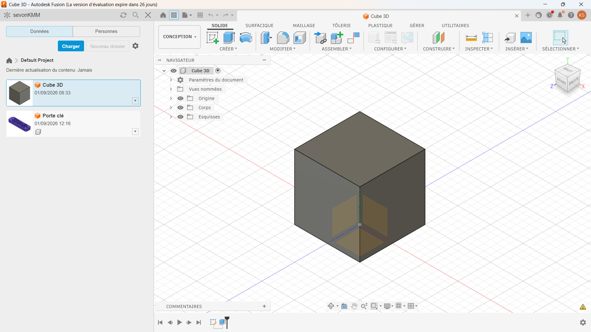

# Journal — Lundi 31 août 2026 (rédigé par : Kangni Marc-Mathieu SEVON)

## Fait aujourd'hui

- Suite de l'étude de projet
- Elaboration du cahier de charge
- Etablissement de la liste des matériels 

- Présentation et initiation au logiciel Fusion 360

## Les appris du jour:

- Les méthode de modélisation de Fusion 360:
  - Extrusion
  - Révolution 
  - Balayage
  - Lissage
  - Congé
  - Coque
- Les méthode de modélisation d'une esquisse dans de Fusion 360:
- Modélisation d'un cube en 3D à partir de Fusion 360
- 

## Logiciel utilisé :
- Fusion 360 