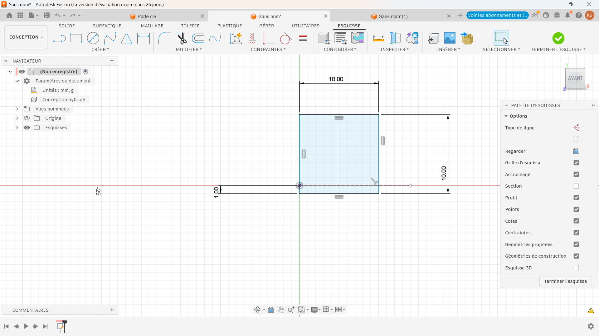
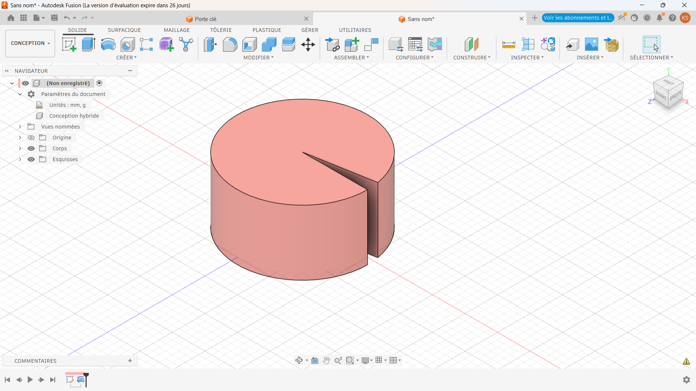
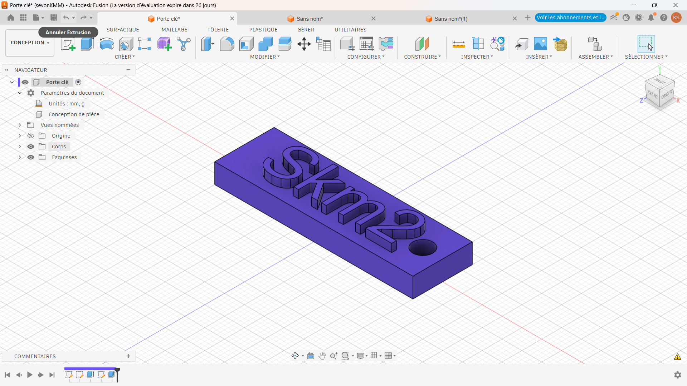
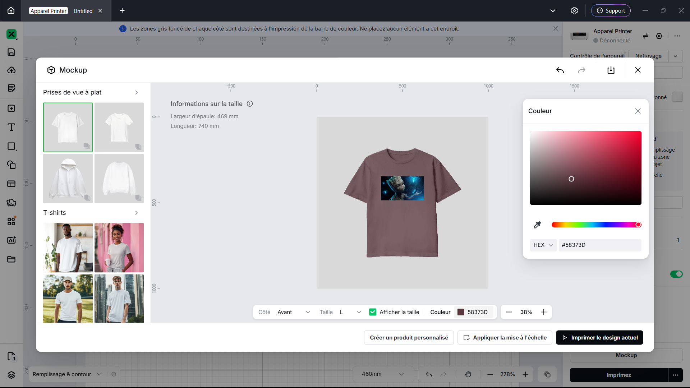

# Journal — Mardi 1 septembre 2026 (rédigé par : Kangni Marc-Mathieu SEVON)

## Fait aujourd'hui

- Modélisation d'un cylindre en 3D
- Modélisation d'une porte clé

- 
- 

## Les appris du jour:

### Modélisation par Fusion 360
#### Modélisation d'un cylindre en 3D à partir de Fusion 360:
   - Par la méthode de révolution
     - 
     - 
   - Par la méthode d'extruision
     - 
#### Modélisation d'une porte clé:
  - Modélisation par extrusion d'une porte clé
     - Modélisation d'un rectangle
     - Modélisation d'un cylindre centré au bord du rectangle
     - Modélisation d'un texte sur le rectangle et extrusion du texte
     - 
  - Modélisation fait par congé d'un objet modélisé
     - 

### Atelier découpe laser:
- Impression DTF avec Xtool
- 

### Atelier d'électronique:
- Familiarisation avec les beardbord
- réalisation de circuits électroniques 

## Logiciel utilisé :
- Fusion 360 
- Xtool studio