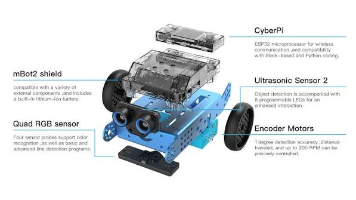
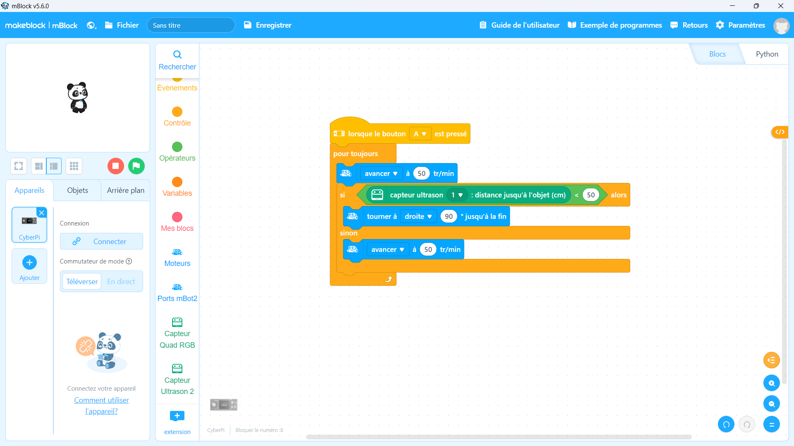

# Journal — Mercredi 2 septembre 2026 (rédigé par : Kangni Marc-Mathieu SEVON)

## Fait aujourd'hui

- Réalisation d'une esquisse du projet : detecteur de fuite de gaz dans une cantine scolaire.
- Algirithmes débranchés
- Assemblage d'un robot M Bot2
- 

## Les appris du jour:
### Projet: Détection de gaz dans une cantine scolaire
- Esquise du dispositif choisi et ajustement de la visualisation première du projet. 

### Algorithme débranché:

- Elle consiste à Apprendre à pensé comme la machine sans ordinateur
- Elle consiste à Manipulation des briques en bois pour construire des séquences d'instruction
- Elle regoupe les même notions que dans un programme: ordre, conditon, répétition
- Elle a pour objectif d'apprendre la logique avant d'écrire une seul ligne de code

### Atelier d'électronique:
- Assemblage d'un robot M Bot2
- [Lien tutoriel Youtube: building mBot2](https://youtu.be/qEUjg-KVvko)
- Code mBlock
- 
