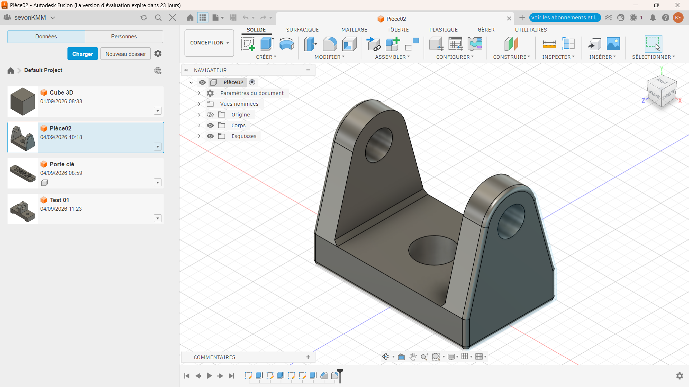
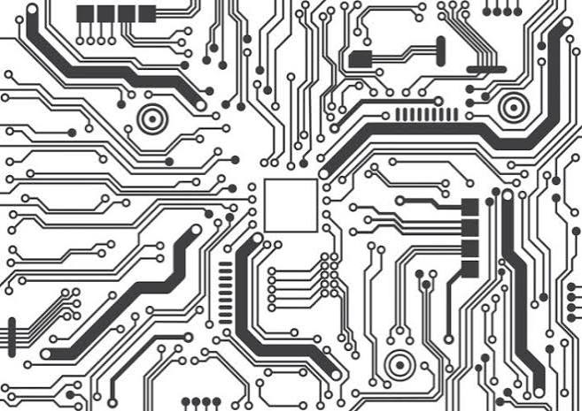

# Journal — Venfredi 4 septembre 2026 (rédigé par : Kangni Marc-Mathieu SEVON)

## Fait aujourd'hui

- Modélisation de deux (02) pièces en 3D 
- Circuit PCB
- Programation Python

## Les appris du jour:

### Modélisation 3D:
- Modélisation de la **pièce symérique  N°1** en utilisant une **symétrie miroire** à l'aide d'un **plan de décalage**
- 

- Modélisation de la **pièce symérique  N°2** en utilisant une **symétrie miroire** à l'aide d'un **plan de décalage**
- 

### Impression des circuits PCB:

- Un ciruit électronique est généralement fait à base de:
  - BeardBord
  - Circuit cablé
  - PCB finalisé
- Il existe des méthode de fabrication du PCB
  1. Perchlorure de fer
  2. Papier glacé + fer à repasser
  3. Fabrication numérique

- 

### Programation Python:

- Conditionnement
- Boucle
- La boucle "Tant que":
- Structre de donnée:
- Les tuples
- Le dictionnaire
 

## Logiciel utilisé:
- Solide Fusion
- Xtool
- Python & Thonny