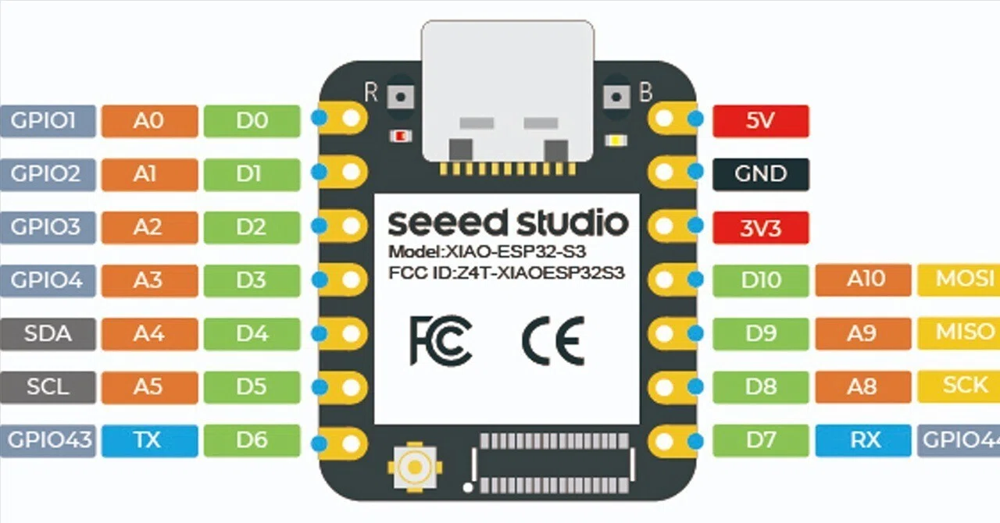
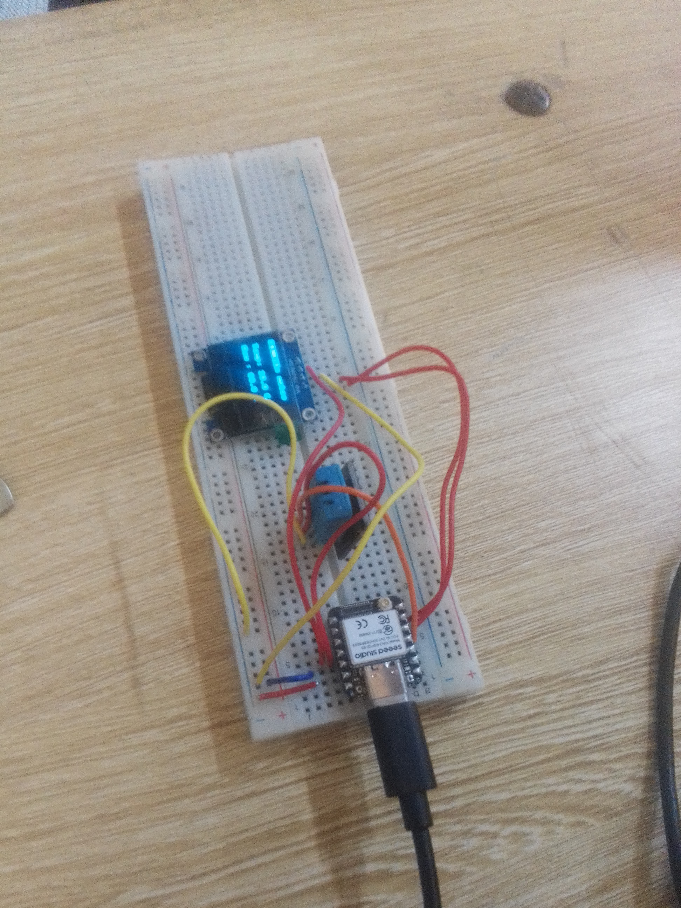

# Journal — Samedi 05 septembre 2026 (rédigé par : Kangni Marc-Mathieu SEVON)

## Fait aujourd'hui

- Réalisation d'une Station météo: (Smart Weather Station)

## Les appris du jour:

### Cablage des capteurs et actionneur sur l'ESP32-S3
- Le cablage des capteur et acionneurs se fait sur l'ESP32-S3 en respectant son GPIO.

### Schéma du câblage:

|Module      |Broche module|ESP32-S3 |
|:----------:|:-----------:|:-------:|
|DHT22       |VCC          |3V3      |
|DHT22       |GND          |GND      |
|DHT22       |DATA         |D3(GPIO4)|
|OLED SSD1306|VCC          |3V3      |
|OLED SSD1306|GND          |GND      |
|OLED SSD1306|SDA          |D4(GPIO5)|
|OLED SSD1306|SCL          |D5(GPIO6)|

## Logiciel utilisé:

- Python & Thonny