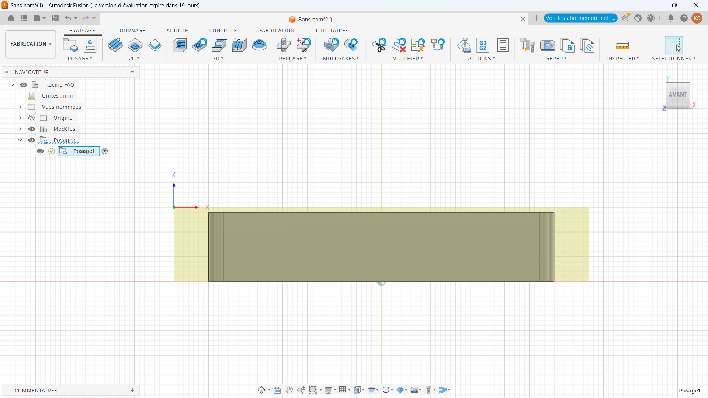
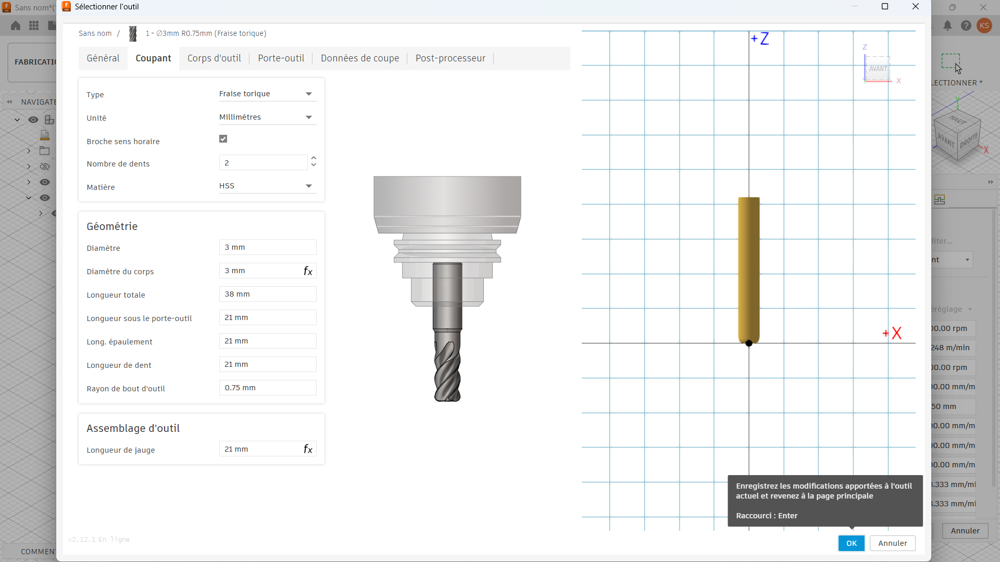
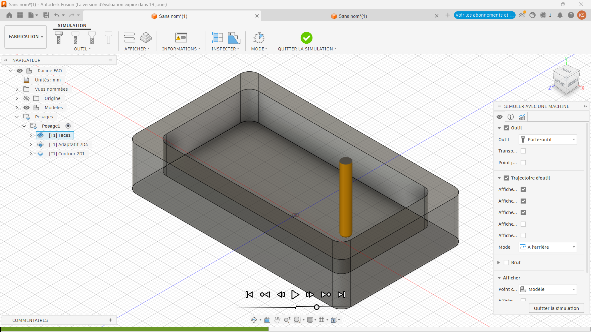

# Journal — Mardi 8 septembre 2026 (rédigé par : Kangni Marc-Mathieu SEVON)

## Fait aujourd'hui

### Etude de projet:
- Etude du projet: Projet de détection de gaz dans une cantine scolaire 
- Cablage virtuel du projet test sur https://app.cirkitdesigner.com
- 
- Implémentation du code pilote de l'écran
- Implémentation du code python sur l'ESP32 S3
- Cablage du des conposants sur le BreadBord et début des simulations

### Conception 3D :
- FAO & usage du CNC
- Parametrage de la fraiseuse CNC

## Les appris du jour:

### Fabrication assister par ordinateur :
- Le flux de travail du FAO sur Fusion 360
  1. Setuo : (il indique comment la la pièce est positionner)
- 
  2. Choix des outils 
- 
  3. Opération d'usinage : ( Face, l'ébauche, la stratégie d'ébauche, la finition)
- 
  4. Simulation : (Pour les vérifierifications avant d'usiner)
- 
- 
- 
  5. Post-traitement : (il consiste à inserer le G-code dans machine)
- 
- 

## Les ratages:

- [Simulation ] → [ESP32 S3 défaillant] → [Changement de composant]

## Programmé sur démain:

- Poursuite du test du prototype 
- Correction des erreurs dû au composant ou au 

## Logiciel utilisé:

- Fusion 360