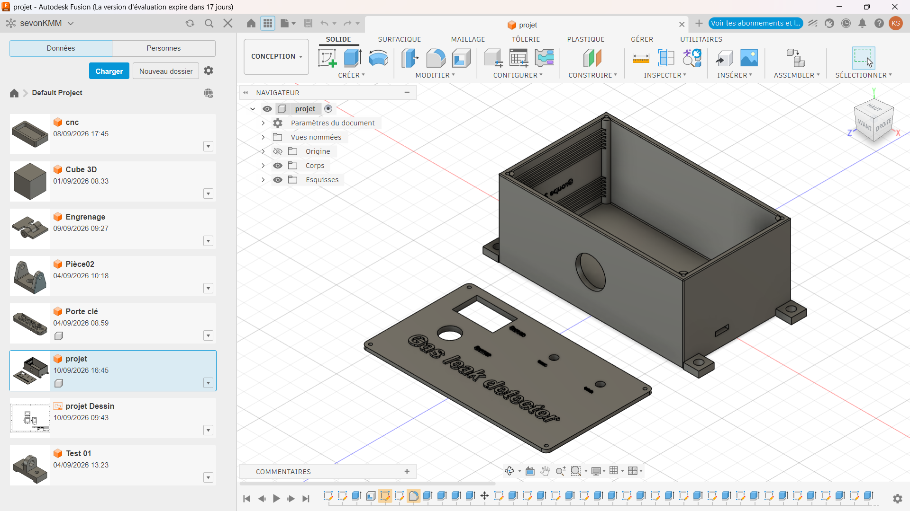
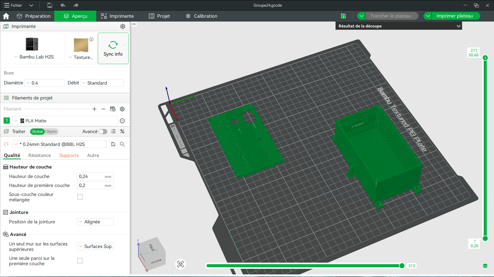

# Journal — Jeudi 10 septembre 2026 (rédigé par : Kangni Marc-Mathieu SEVON)

## Fait aujourd'hui :

- ETUDE DE PROJET: Détection de fuite de gaz dans une cantine scolaire
  1. Modélisation 3D du boitier support du circuit électronique sur Fusion 360
  2. Vérification du schéla électronique et cablage du circuit.
  3. Tentative d'impression du corps modélisé en 3D
  

## Les appris du jour :

#### Modélisation 3D du boitier
- 

#### Parametrage du ficher d'impression:
- 

#### Vérification du cablage du circuit électronique
- 

## Les ratages:
- [Positionnement de deux corps sur le plateau d'impression] → [Non maitrise de l'outil Fusion 360] → [Rectification des erreur]→[Parametrage du G-code]
- [Impression] → [Machine d'impression surchargé] → [Impression reprogrammé]

## Décidés:
- Impression du boitier du projet reporté sur le jour suivant
- Finalisation du test du circuit électronique

## Logiciel utilisé:

- Fusion 360
- Bambu studio
