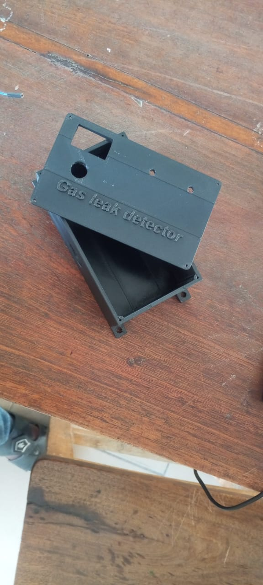
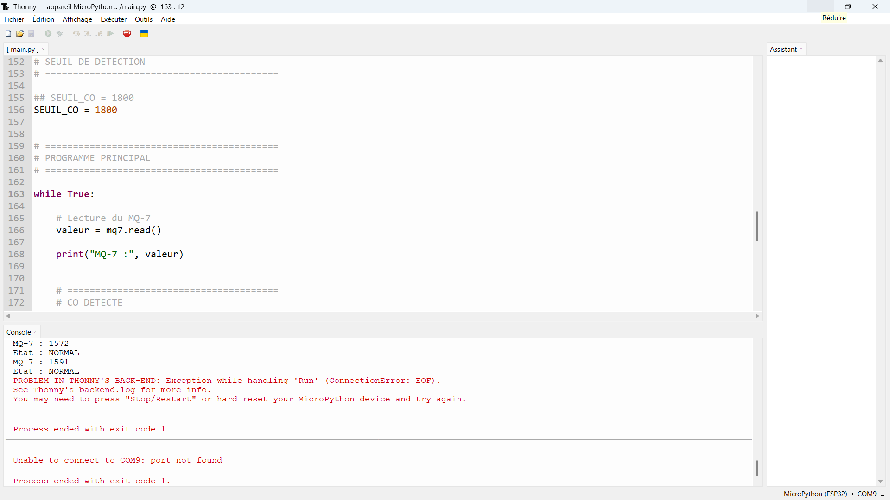
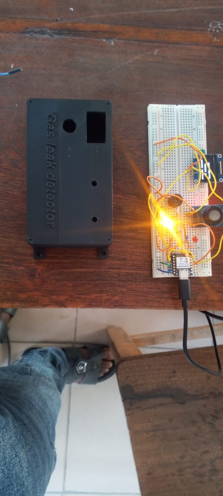
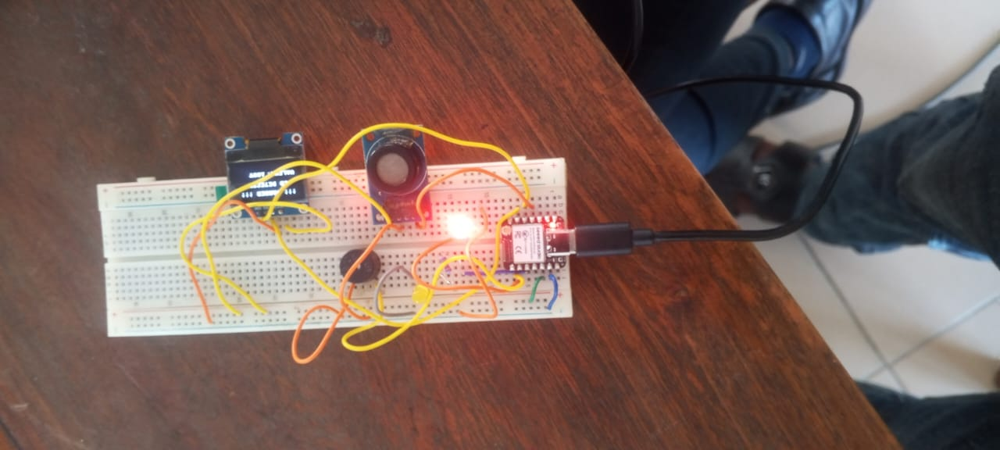
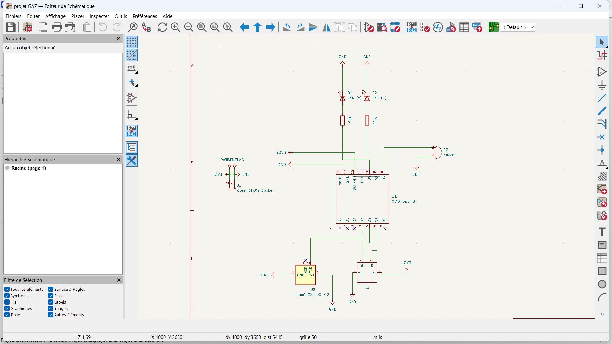
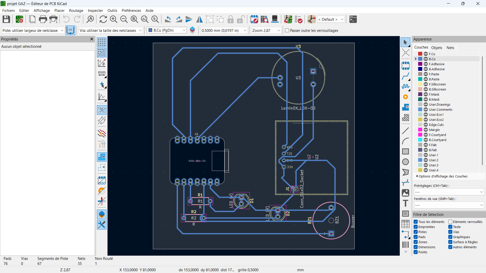
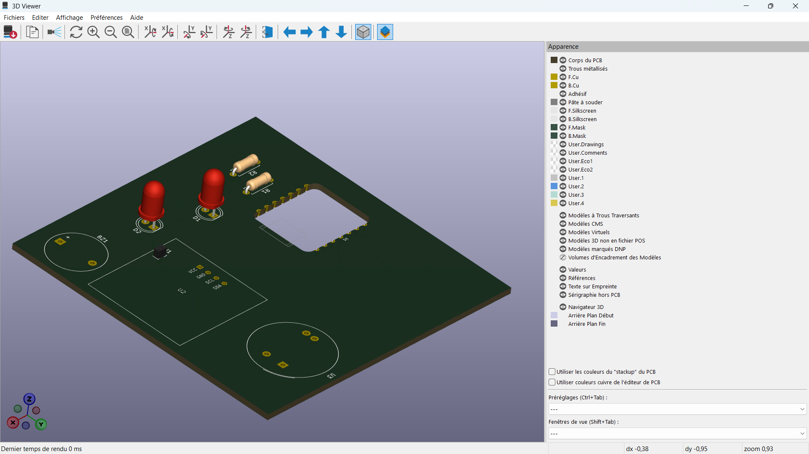

# Journal — Vendredi 11 septembre 2026 (rédigé par : Kangni Marc-Mathieu SEVON)

## Fait aujourd'hui :

### ETUDE DE PROJET: Détection de fuite de gaz dans une cantine scolaire
  1. Recablage du ciruit de test-projet
  2. Impression d'un prototype du boitier du projet avec la Bambu Lab H2S
  3. Edition du code mini-python du Micro-controleur dans le logiciel Thonny
  4. Retouche du corps modélisé 3D du boitier
  5. Conception de la carte PCB du à partir du circuit test du projet
  

## Les aquisitions du jour :

  #### Impression d'un prototype du boitier du 

  #### Edition du code mini-python du Micro-controleur

  #### Test du circuit sur un bearBoard:

  #### Conception de la carte PCB du à partir du circuit test du projet
  1. Schematisation du circuit-Projet dans le logiciel Kicad
  
  2. Conception du circuit PCB dans Kicad
  
  

## Les ratages du jour:

- [Erreur] → [Cause] → [Décision]→ [Résultat]
- [Conception du boitier] → [Mauvais dimentionnement du corps en modélisation] → [Ajustement des dimention]
- [Test du code du Micro-controleur] → [Code python mal écrit] → [Réédition du code python]
- [Test du code du Micro-controleur] → [Cablage du circuit non adapter au code Python] → [Réédition du code python]
- [Test d'allumage des LED] → [Mauvais Cablage du circuit] → [Recablage du circuit test]→ [Allumage reussi]

- [Test du circuit] → [Cablage du circuit non adapter au code Python] → [Adaptation du code python au circuit optimisé]→ [Test reussi]

- [Erreur de schématisation du schéma du circuit dans Kicad] → [Mauvaise manipulation de Kicad] → [Assistance des facilitateurs]→ [Schéma reussi]

- [Erreur de schématisation du schéma du PCB dans Kicad] → [Mauvaise manipulation de Kicad] → [Assistance des facilitateurs]→ [Solution non trouvé]

## Les prévisions:
- Finalisation de la carte PCB
- Finalisation des ajustements des dimenssions dans la modélisation 3D du boitier et impression si possible
- Impression de la carte PCB si possible

## Logiciel utilisé:

- Bambu studio
- Fusion 360
- Thonny
- Kicad
