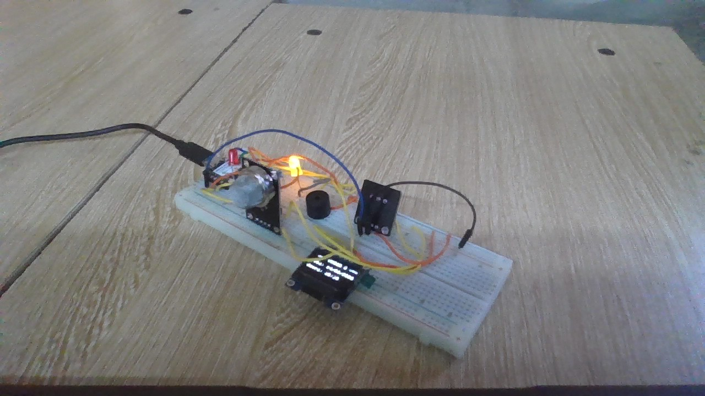
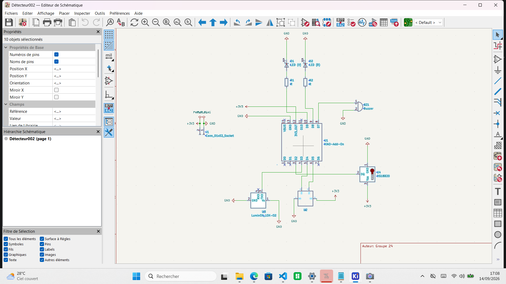

# Journal — Lundi 14 septembre 2026 (rédigé par : Kangni Marc-Mathieu SEVON)

## Fait aujourd'hui :

### ETUDE DE PROJET: Détection de fuite de gaz dans une cantine scolaire
  1. Réévaluation des fonction du projet
  2. Vérification des aquisition du 12 septembre 2026
  3. Reprogramation du Corps du code python 
  4. Ajout de la fonction de détection de température au projet
  5. Réadaptation du Schéma électronique du projet 
  6. Réadaptation du PCB à au capteur de température
  
## Les aquisitions du jour :

  #### Vérification des aquisition du 12 septembre 2026
  - Revison du cablage du circuit test avec ajout d'un capteur de temperature DS18B20
  - 
  - 

  #### Reprogramation du Corps du code python
  - Ajout de la fonction de détection de température au code de base
  - Ajoute de la tache muti-écran dans le fonctionnement du code
    - Ecran N°1: affiche l'état de l'air et la température en degré celsius(°C)
    - Ecran N°2: affiche la date et l'heure en syncronisation avec un Wifi
    - Ecran N°3: affiche le Taux de gas détecté; le ppm(parties par million) et l'ADC( Analog-to-Digital Converter, en français: CAN pour Convertisseur Analogique-Numérique) mesuré dan l'air
    - Ecran N°4: affiche le nom du Wifi et l'état de la connexion de l'ESP32 au wifi

  #### Réadaptation du Schéma électronique du projet 
  - 

## Les ratages du jour:
- [Problème] → [Cause] → [Correction]→ [Résultat]
- [Adaptation du code fonctionnel python du projet à la nouvelle fonction de messagerie (alerte)] → [Problème de code d'autentification du Bot de télégram] → [Abandon de méthode]→ [Aucun résultat]
- [Adaptation du code fonctionnel python du projet à la nouvelle fonction de messagerie (alerte)] → [Problème de code d'autentification du APIkey du whatsapp Bot] → [Abandon de méthode]→ [Aucun résultat]
- [Reprogramation du code python] → [Problème de syntaxe du code] → [Correction de la syntaxe]→ [Code fonctionnel]

## Les prévisions:
- Adaptation et finalisation de la carte PCB
- Finalisation des ajustements des dimenssions dans la modélisation 3D du boitier et impression si possible
- Impression de la carte PCB si possible

## Logiciels utilisé:
- Thonny
- Kicard