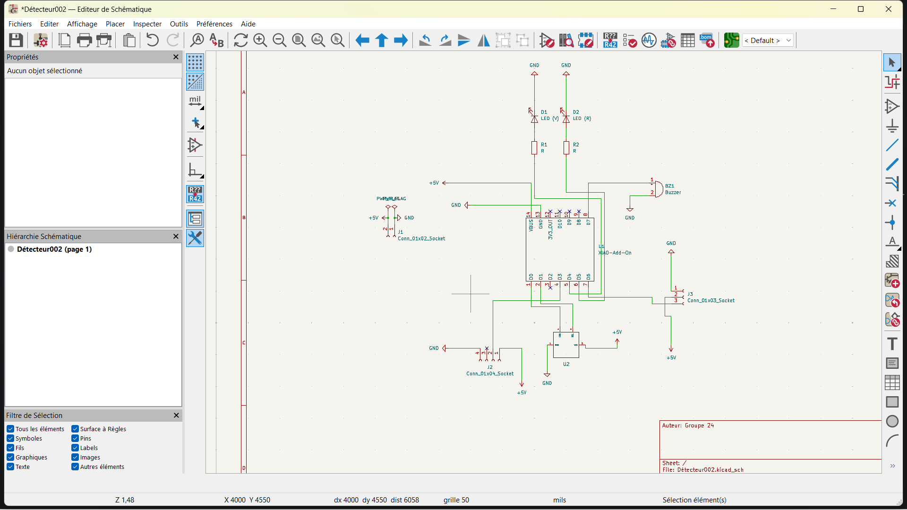
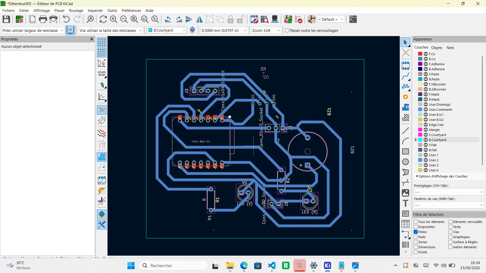
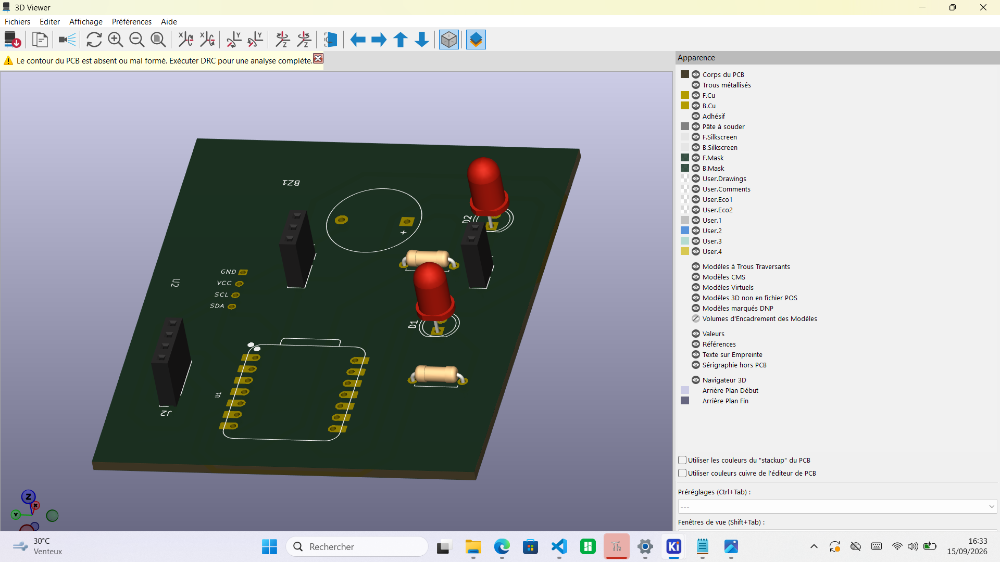

# Journal — Mardi 15 septembre 2026 (rédigé par : Kangni Marc-Mathieu SEVON)

## Fait aujourd'hui :

### ETUDE DE PROJET: Détection de fuite de gaz dans une cantine scolaire
  1. Vérification des aquisition du 14 septembre 2026
  2. Verification de la fonctionnalité du projet
  3. Conception et finalisation de la modéllisation du PCB
  3. Impression du PCB et finalisation de la modéllisation du PCB
 
  
## Les aquisitions du jour :

  ####  Verification de la fonctionnalité du projet
  - Revison et test du code sourec python du projet
  - Supression de la foction de messagerie d'alerte

  #### Conception et finalisation de la modélisation du PCB
  - Modicication du Schéma électronique du projet 
  
  - Mise à jour du PCB au capteur au nouveau schéma
  

  #### Révision du Schéma électronique et lise à jour du PCB
  - Modification du schéma en raison de la complexité de la confection des pistes
  

  #### Impression du PCB et finalisation de la modéllisation du PCB
  

## Les ratages du jour:
- [Problème] → [Cause] → [Correction]→ [Résultat]
- [Conception du PCB ] → [Détection d'erreur] → [Correctiondes erreurs]→ [Finalisation et impression du prototype du PCB]

## Les prévisions:
- Finalisation des ajustements des dimenssions dans la modélisation 3D du boitier et impression si possible
- Reprogrammation du code python aux modifications apporté au cablage
- Soudure des composants sur le PCB et debut de la finition du projet

## Logiciels utilisé:
- Thonny
- Kicard
- Fusion 360