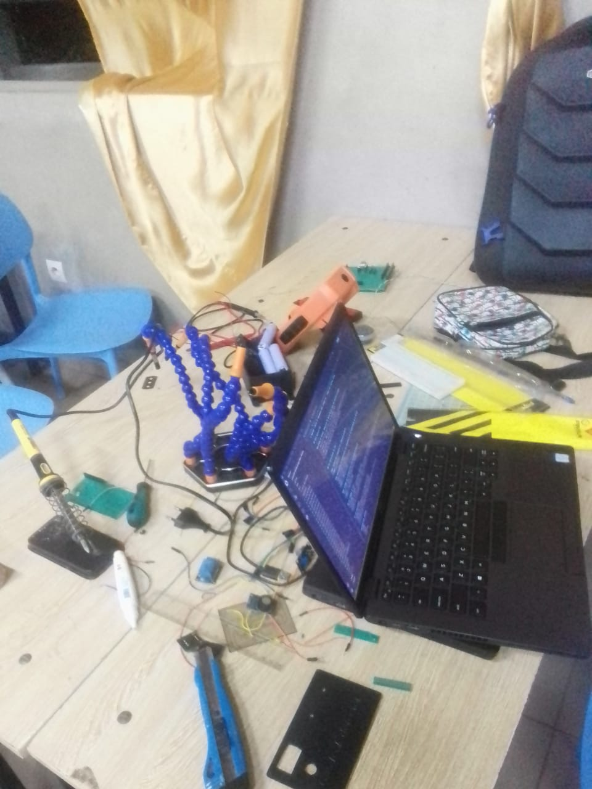
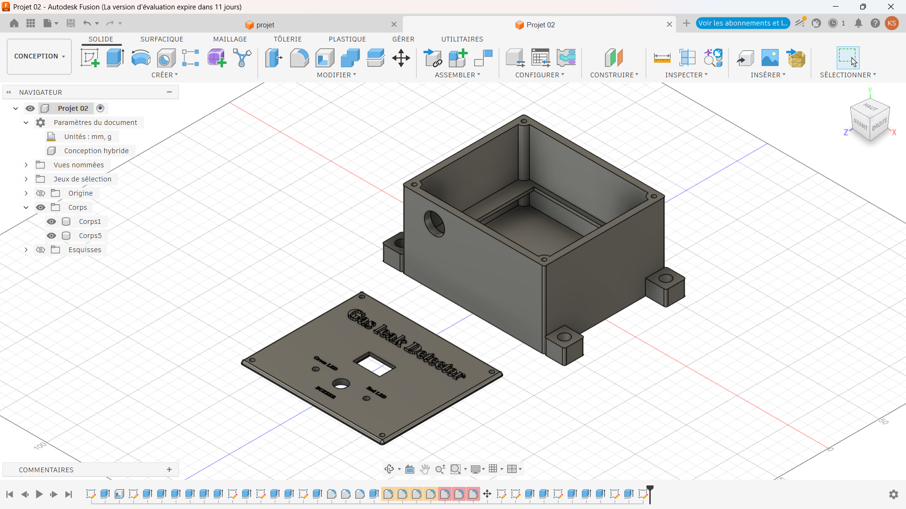

# Journal — Mercredi 16 septembre 2026 (rédigé par : Kangni Marc-Mathieu SEVON)

## Fait aujourd'hui :

### ETUDE DE PROJET: Détection de fuite de gaz dans une cantine scolaire
  1. Vérification des aquisition du 15 septembre 2026
  2. Soudure des composant sur plaquette perforée
  3. Réévaluation et modification des dimenssions de la modélisation 3D du boitier
  4. Cablage de l'alimentation avec la plaquette perforée
 
  
## Les aquisitions du jour :

  ####  Soudure des composant sur plaquette perforée
  

  #### Réévaluation et modification des dimenssions de la modélisation 3D du boitier
  - Dimenssionnement du boitier
  - Dimenssionnement des ports et sorties
  

  #### Cablage de l'alimentation avec la plaquette perforée
  - Ajout d'un module de charge dans le capblage
  

## Les ratages du jour:
- [Problème] → [Cause] → [Correction]→ [Résultat]
- [Conception du PCB ] → [Détection d'erreur] → [Correctiondes erreurs]→ [Abandon de la conception du du PCB]
- [Soudure des sur plaquette perforée] → [Erreur tectechiques] → [Correctiondes erreurs]→ [Plaquet perforé oppérationnelle]

## Les prévisions:
- Cablage de l'alimentation à la plaquette perforée
- Finalisation du boitier et impression si possible
- Finalisation de la liaison de la plaquette perforée avec le l'alimentation

## Logiciels utilisé:
- Thonny
- Kicard
- Fusion 360