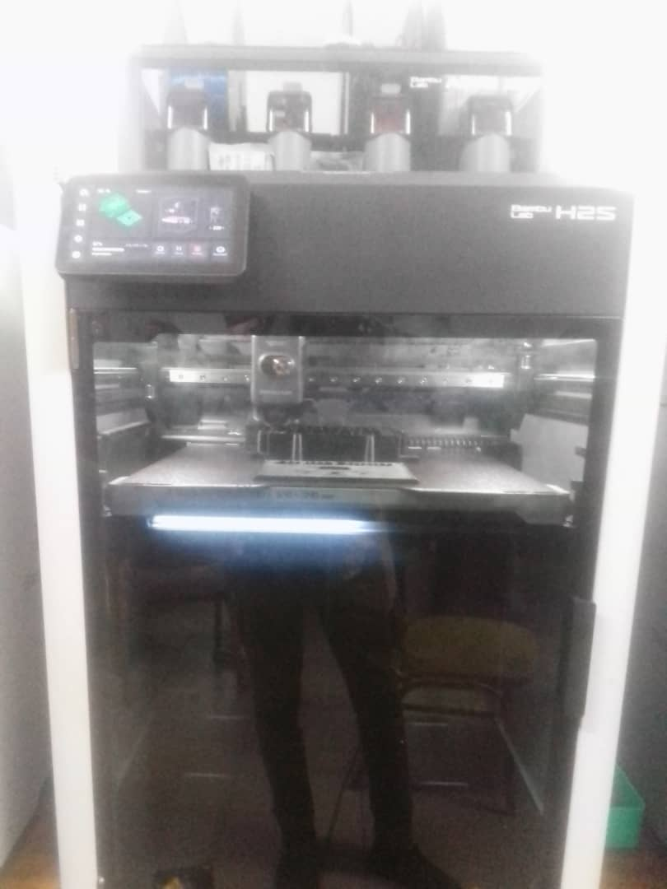

# Journal — Jeudi 17 septembre 2026 (rédigé par : Kangni Marc-Mathieu SEVON)

## Fait aujourd'hui :

### ETUDE DE PROJET: Détection de fuite de gaz dans une cantine scolaire
  1. Vérification des aquisition du 16 septembre 2026
  2. Finition du cablage de l'alimentation avec la plaquette perforée
  3. Impression du boitier
  4. Mise en boite du circuit total
  5. Edition du PowerPoint
 
  
## Les aquisitions du jour :

  #### Finition du cablage de l'alimentation avec la plaquette perforée
  

  #### Impression du boitier
  

## Les prévisions:
- Présentation du projet en soutenance

## Les ratages du jour:
- [Problème] → [Cause] → [Correction]→ [Résultat]
- [cablage de l'alimentation avec la plaquette perforée] → [Problème de composant électronique non adapté] → [Recherche de d'autre composant disponible]→ [Aucun]
- [Impression N°1 du boitier] → [Plateau trop choaude ] → [Relancement de l'impression]→ [Echec de l'impression]
- [Impression N°2 du boitier] → [impression 1ère couche non défaillante] → [Relancement de l'impression]→ [Echec de l'impression]
- [Impression N°3 du boitier] → [impression 1ère couche non défaillante] → [Relancement de l'impression]→ [Echec de l'impression]
- [Impression N°4 du boitier] → [impression 1ère couche non défaillante] → [Relancement de l'impression]→ [Impression réussie]

## Logiciels utilisé:
- Thonny
- Kicard
- Fusion 360